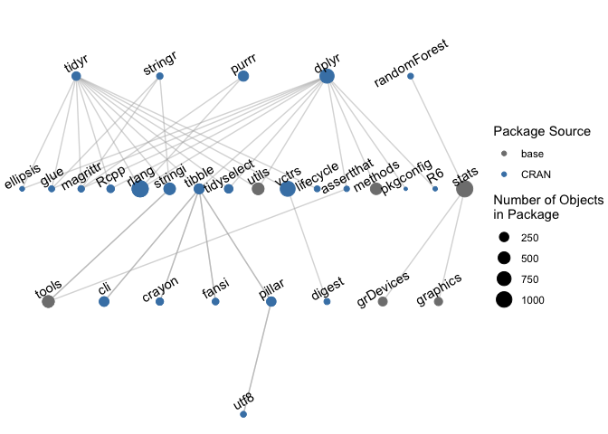

manager
================
Kiegan Rice, Heike Hofmann

<!-- README.md is generated from README.Rmd. Please edit that file -->

<!-- badges: start -->

<!-- badges: end -->

The goal of manager is to provide users with tools to use an adaptive
computational reproducibility in their data projects. Adaptive
computational reproducibility uses a two-step approach:

1.  Define and refine the extent of package dependencies used in a
    script or project.  
2.  Compare package inventories across machines, users, and time to
    identify changes in functions and objects.

This is accomplished using package *inventories*.

## Installation

You can install the development version from
[GitHub](https://github.com/) with:

``` r
# install.packages("remotes")
remotes::install_github("kiegan/manager")
```

## Take Package Inventory

We can first take a package inventory for a given set of packages, and
visualize the dependency tree implicit when calling that set of
packages.

``` r
library(manager)
project_inventory <- take_inventory(packages = c("tidyr", "stringr", 
                                                 "purrr", "dplyr", 
                                                 "randomForest")) 
plot_inventory(project_inventory)
```



The set of packages at the top of the graphic represent “explicit”
package dependencies, which are the packages we want to keep track of.
All subsequent layers are “implicit” package dependencies, which arise
from calling the set of explicit dependencies.

We can also store these
inventories:

``` r
store_inventory(project_inventory, filepath = "path/to/storage/folder/inventory.rda")
```

Taking and storing an inventory allows for:

  - Comparison with updated inventories at a later date  
  - Sending to team members/collaborators to compare differences across
    users and machines

## Compare Package Inventories

Suppose a colleague sends me their inventory of the same set of packages
so we can identify differences. I can load that as “userB\_inventory”
using the `readRDS()` function and compare the two:

``` r
ab_compare <- compare_inventory(inventory1 = project_inventory,
                                   inventory2 = userB_inventory,
                                   summary_file = "data/ab_compare.txt")
```

We can then investigate identified differences between the two
inventories using the object `ab_compare` and the summary text file
generated at the `summary_file` filepath. The summary is printed in the
console if no filepath is provided.

The `$table` element provides a summary table of changed objects and
descriptive characteristics of the differences between objects. There is
one row for every object which differs between the two inventories.

``` r
head(ab_compare$table)
#> # A tibble: 6 x 6
#>   package_name object_name object_presence  object_changes  obj_same params_same
#>   <chr>        <chr>       <chr>            <chr>           <lgl>    <lgl>      
#> 1 cli          is_ansi_tty Object in both … Objects change… FALSE    TRUE       
#> 2 digest       digest      Object in both … Objects change… FALSE    TRUE       
#> 3 dplyr        contains    Object in both … Both object an… FALSE    FALSE      
#> 4 dplyr        ends_with   Object in both … Both object an… FALSE    FALSE      
#> 5 dplyr        enquos      Object in both … Objects change… FALSE    TRUE       
#> 6 dplyr        everything  Object in both … Both object an… FALSE    FALSE
```

The `$objects` element contains the same information as `$table`, but
additionally provides more detail, including the deparsed objects for
each of the provided inventories for direct comparison. The deparsed
objects are found in the `function_text_inv1` and `function_text_inv2`
columns.

``` r
head(ab_compare$objects)
#> # A tibble: 6 x 22
#>   package_name object_name object_presence object_changes obj_same params_same
#>   <chr>        <chr>       <chr>           <chr>          <lgl>    <lgl>      
#> 1 cli          is_ansi_tty Object in both… Objects chang… FALSE    TRUE       
#> 2 digest       digest      Object in both… Objects chang… FALSE    TRUE       
#> 3 dplyr        contains    Object in both… Both object a… FALSE    FALSE      
#> 4 dplyr        ends_with   Object in both… Both object a… FALSE    FALSE      
#> 5 dplyr        enquos      Object in both… Objects chang… FALSE    TRUE       
#> 6 dplyr        everything  Object in both… Both object a… FALSE    FALSE      
#> # … with 16 more variables: package_source_inv1 <chr>,
#> #   package_version_inv1 <chr>, package_gitrepo_inv1 <chr>,
#> #   package_gitcommit_inv1 <chr>, function_text_inv1 <list>,
#> #   fun_params_inv1 <list>, obj_checksum_inv1 <chr>,
#> #   params_checksum_inv1 <chr>, package_source_inv2 <chr>,
#> #   package_version_inv2 <chr>, package_gitrepo_inv2 <chr>,
#> #   package_gitcommit_inv2 <chr>, function_text_inv2 <list>,
#> #   fun_params_inv2 <list>, obj_checksum_inv2 <chr>, params_checksum_inv2 <chr>
```

We can now compare the deparsed text of the function across two
inventories:

``` r
ab_compare$objects %>% 
  filter(package_name == "dplyr", object_name == "contains") %>% 
  pull(function_text_inv1)
#> [[1]]
#> [1] "function (match, ignore.case = TRUE, vars = peek_vars(fn = \"contains\")) "
#> [2] "{"                                                                         
#> [3] "    check_match(match)"                                                    
#> [4] "    if (ignore.case) {"                                                    
#> [5] "        vars <- tolower(vars)"                                             
#> [6] "        match <- tolower(match)"                                           
#> [7] "    }"                                                                     
#> [8] "    flat_map_int(match, grep_vars, vars, fixed = TRUE)"                    
#> [9] "}"
ab_compare$objects %>% 
  filter(package_name == "dplyr", object_name == "contains") %>% 
  pull(function_text_inv2)
#> [[1]]
#> [1] "function (match, ignore.case = TRUE, vars = peek_vars()) "
#> [2] "{"                                                        
#> [3] "    stopifnot(is_string(match), nchar(match) > 0)"        
#> [4] "    if (ignore.case) {"                                   
#> [5] "        vars <- tolower(vars)"                            
#> [6] "        match <- tolower(match)"                          
#> [7] "    }"                                                    
#> [8] "    grep_vars(match, vars, fixed = TRUE)"                 
#> [9] "}"
```

## Search a Script for Objects Which Differ

``` r
script_check(compare_object = ab_compare, 
             script_filepath = "path/to/R/script.R") # for an .R script 
script_check(compare_object = ab_compare, 
             script_filepath = "path/to/R/script.Rmd", 
             is_R_script = F) # function will convert .Rmd, .Rnw to .R before parsing  
```
